<h1 align="center">Hi 👋, I'm zhanglun</h1>
<h3 align="center">A passionate programmer from China</h3>

  

  

<table>
<tr>
  <td valign="top" width="50%">

- 🔭 I’m currently working on **something cool!**

- 🌱 I’m currently learning **Rust**

- 👨‍💻 All of my projects are available at [zhanglun.github.io/labs](https://zhanglun.github.io/labs)

- 📫 How to reach me **zhanglun1410@gmail.com**

- 📄 Know about my experiences [zhanglun.github.io/about](https://zhanglun.github.io/about)

<h3 align="left">Connect with me:</h3>

</td>
  <td valign="top" width="50%">

</td>
</tr>

